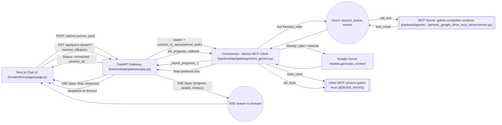
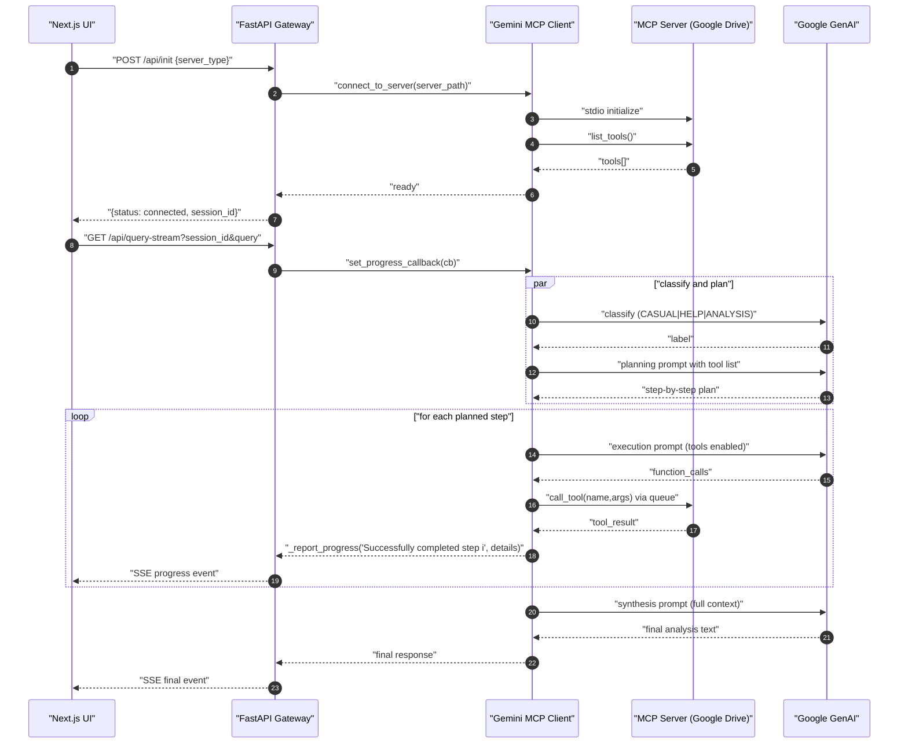

## Architecture overview (code-accurate)

- **Backend: FastAPI gateway** (`backend/api/gateway/app.py`)

  - **CORS**: configurable via `ALLOWED_ORIGINS` env (defaults to localhost).
  - **Session lifecycle**:
    - `POST /api/init` creates or replaces a session, instantiates the Gemini MCP client, connects to the selected MCP server via stdio, caches `session_id` → client in memory, and returns available tool names.
    - `DELETE /api/session/{session_id}` cleans up and removes a session.
    - `GET /api/health` returns health and `active_sessions` count.
  - **Query processing**:
    - `POST /api/query` runs a single-turn request via the MCP client and returns the final response JSON.
    - `GET /api/query-stream?session_id=…&query=…` opens an SSE stream:
      - Sets a progress callback into the MCP client.
      - Spawns the analysis task; streams progress events and a final event.
      - Emits keepalive messages on idle timeouts, and a final error message if timeouts accumulate post-completion.

- **Orchestrator: Gemini MCP Client** (`backend/api/gateway/client_gemini.py`)

  - **LLM**: Google GenAI `genai.Client()`; models: `gemini-2.5-flash` primary and final, with `gemini-1.5-flash` fallback.
  - **MCP connection**: `mcp.client.stdio` spawns and connects to an MCP server script path; `ClientSession` handles `initialize`, `list_tools`, and `call_tool`.
  - **Flow per query**:
    - Conversation history management and context compaction.
    - Classification: LLM returns `CASUAL_CONVERSATION | HELP_REQUEST | ANALYSIS_NEEDED`.
    - If casual/help → respond directly; else run strategic analysis:
      - Phase 1–2: Analyze the user query and plan steps using available MCP tools (from `list_tools`).
      - Phase 3: Execute steps:
        - Prompt LLM with tools enabled to produce function calls.
        - Parse `function_calls`; enqueue each into `request_queue`; queue worker calls `session.call_tool`.
        - Collect results; update metrics; stream progress via `_report_progress`.
      - Phase 4: Critical evaluation with LLM over accumulated context.
      - Phase 5: Synthesis with LLM for final answer; return text.
  - **Tool calling**: Cleans schemas for Gemini; extracts function calls; manages async queue; aggregates results; formats results for follow-up prompts.
  - **Progress streaming**: `set_progress_callback` is injected by gateway; client calls it with messages, step markers, and metrics.
  - **Token tracking**: rough usage/cost estimates recorded for each call.

- **Alternative orchestrator (deprecated): Claude MCP Client** (`backend/api/gateway/client_claude.py`)

  - Similar orchestration structure using Anthropic Messages API.
  - Maintained but the gateway defaults to Gemini.

- **Agents (MCP servers)**
  - Google Drive document processing server (`backend/agents/document_processor/generic_google_drive_mcp_server/server.py`):
    - Exposes MCP tools:
      - `list_drive_folders(parent_folder_id?)`
      - `list_drive_files(folder_id?, file_types="all")`
      - `get_file_content(file_id, max_chars=100000)` with content extraction for PDF, Excel, Word, PowerPoint, TXT.
      - `get_file_metadata(file_id)`
      - `search_drive_files(query, folder_id?)`
    - Uses Service Account credentials for Drive API; caches file contents; robust per-type extraction and chunking helpers.
  - Other MCP servers referenced via `SERVER_PATHS` in the gateway:
    - `rfx`: `./backend/agents/rfx_analyzer/mcp-server_rfx/server_test.py`
    - `samsara`: `./backend/agents/samsara_integration/mcp_server_samsara/server.py`
    - `raw_rfx`: `./backend/agents/raw_data_processor/mcp_server_rfx_raw_data/server.py`

## Request flow (expanded, code-accurate)

- **Session**

  - `POST /api/init`:
    - Validates server type against `SERVER_PATHS`.
    - Creates Gemini MCP client → `connect_to_server(server_path)` → `initialize` → `list_tools`.
    - Stores `active_sessions[session_id] = client`, returns `{status: "connected", response: {"session_id", "server_type", "available_tools": [...]}}`.

- **Query (SSE)**

  - `GET /api/query-stream?session_id&query`:
    - Validates session; yields an initial progress event.
    - Injects a `progress_callback` into the MCP client to enqueue progress messages.
    - Runs `client.process_query(query)` in background task.
    - For each queued item: writes an SSE event.
    - On completion: emits a final event with `response` or `error`.
    - Keepalive every ~20s if idle, with cut-off after 3 consecutive timeouts.

- **Query (non-streaming fallback)**

  - `POST /api/query`:
    - Calls `client.process_query(query)` and returns `{status: "success", response}` or `{status: "error", message}`.

- **Frontend consumption**
  - Establishes SSE, updates `progressDetails` and `progressIndicator` with each event, appends final assistant message when `type === 'final'` (`frontend/src/pages/page.js`).

## Notable implementation details

- Gateway initializes the Gemini-based MCP client by default.
- SSE formatting includes step completion detection by parsing messages for “Successfully … step X”.
- MCP client tracks operation metrics (queries executed, documents processed, folders scanned) and includes these in progress details.
- Tool schemas returned by MCP are normalized for Gemini compatibility.
- Google Drive MCP server robustly handles Google MIME exports and per-type parsing.
- Cleanup is implemented on FastAPI lifespan shutdown and explicit `DELETE /api/session/{id}`.

## Diagrams

## Key data contracts

- **Init session**

  - Request: `POST /api/init` with JSON `{ "server_type": "rfx" | "samsara" | "raw_rfx" }`
  - Response (success): `{"status":"connected","response":"{\"session_id\":\"…\",\"server_type\":\"…\",\"available_tools\":[…]}"}`

- **Streaming query**

  - Request: `GET /api/query-stream?session_id=...&query=...` (SSE)
  - Events:
    - Progress: `{ "type":"progress", "message":"…", "details":{...}, "metrics":{...}, "timestamp":... }`
    - Keepalive: `{ "type":"keepalive", "consecutive_timeouts":n, "processing_complete":bool, "queue_empty":bool, "final_sent":bool, "timestamp":... }`
    - Final: `{ "type":"final", "response":"<final_text>", "timestamp":... }`
    - Error: `{ "type":"error", "message":"…", "timestamp":... }`

- **Non-streaming query**
  - Request: `POST /api/query` with `{ "session_id":"…", "query":"…" }`.
  - Response: `{ "status":"success", "response":"<final_text>" }` or `{ "status":"error", "message":"…" }`.

## Endpoints

- `POST /api/init`
- `POST /api/query`
- `GET /api/query-stream`
- `GET /api/server-types`
- `GET /api/health`
- `DELETE /api/session/{id}`
