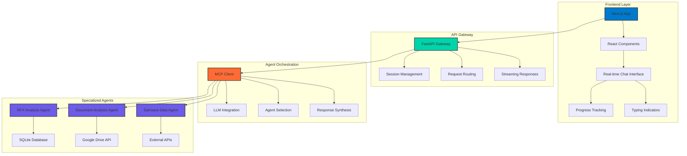

# Agentic AI Knowledge Base Platform

[](https://nextjs.org/)
[](https://reactjs.org/)
[](https://fastapi.tiangolo.com/)
[](https://python.org/)
[](https://modelcontextprotocol.io/)
[]()

> **A sophisticated agentic AI platform demonstrating advanced multi-agent orchestration, real-time data processing, and intelligent knowledge synthesis capabilities.**

## 🎥 Demo Video

https://github.com/your-username/agentic-ai-knowledge-base/assets/your-user-id/Agentic%20AI%20Platform.mp4

*Watch the platform in action - showcasing real-time multi-agent orchestration, streaming responses, and intelligent knowledge synthesis.*

## 🎯 Project Overview

This project demonstrates my capabilities in building sophisticated **agentic AI systems** that can intelligently orchestrate multiple specialized agents to process, analyze, and synthesize information from diverse data sources. The platform showcases advanced concepts in:

- **Multi-Agent Orchestration**: Coordinating specialized AI agents for different data domains
- **Real-Time Data Processing**: Streaming responses with progress tracking and typing indicators
- **Intelligent Knowledge Synthesis**: Combining insights from multiple sources into coherent responses
- **Modern Full-Stack Architecture**: Next.js frontend with FastAPI backend and MCP protocol integration

### 💡 Key Capabilities Demonstrated

- **Intelligent Agent Coordination**: Multiple MCP servers working together through a central orchestrator
- **Advanced UI/UX**: Real-time streaming, progress tracking, and responsive design
- **Data Source Integration**: SQLite databases, Google Drive APIs, and document processing
- **Production-Ready Architecture**: Error handling, session management, and scalable design
- **Modern Development Practices**: TypeScript, testing, and comprehensive documentation

## 🏗️ Architecture

The platform implements a sophisticated distributed architecture with intelligent agent orchestration:



### System Flow

1. **User Input**: Messages sent through the Next.js chat interface
2. **Request Processing**: FastAPI gateway handles authentication and routing
3. **Agent Selection**: MCP Client analyzes intent and selects appropriate specialized agents
4. **Parallel Processing**: Multiple agents work simultaneously on different data sources
5. **Response Synthesis**: Results are intelligently combined and formatted
6. **Real-time Delivery**: Streaming responses with progress updates and typing indicators

## 🛠️ Tech Stack

### Frontend
- **Framework**: Next.js 15.2.1 with React 19
- **Styling**: Tailwind CSS 4, NextUI, Framer Motion
- **State Management**: React Hooks with custom state management
- **Real-time Features**: Server-Sent Events for streaming responses
- **Testing**: Jest with React Testing Library

### Backend API (Gateway)
- **Framework**: FastAPI with async/await support
- **Authentication**: Session-based with UUID management
- **Streaming**: Server-Sent Events for real-time communication
- **Error Handling**: Comprehensive error management and logging

### Agent Orchestration (MCP Client)
- **Protocol**: Model Context Protocol (MCP) implementation
- **LLM Integration**: Google Generative AI (Gemini) and Claude APIs
- **Agent Management**: Dynamic agent selection and coordination
- **Response Processing**: Intelligent synthesis and formatting

### Specialized Agents (MCP Servers)
- **RFX Analysis Agent**: SQLite database queries and analysis
- **Document Analysis Agent**: Google Drive integration with multi-format support
- **Samsara Data Agent**: External API integration and data processing
- **Raw Data Agent**: Advanced document processing and caching

### Data Sources & APIs
- **Databases**: SQLite with aiosqlite for async operations
- **Cloud Storage**: Google Drive API with service account authentication
- **Document Processing**: PDF, DOCX, XLSX, PPTX support
- **External APIs**: Samsara and other third-party integrations

## 📦 What's in This Repository

This repository contains the **complete implementation** of the agentic AI platform, including:

### ✅ Complete Frontend Implementation
- **Full Next.js Application**: Complete React-based chat interface
- **Real-time Features**: Streaming responses, progress tracking, typing indicators
- **Responsive Design**: Mobile-optimized with modern UI components
- **State Management**: Comprehensive session and connection management
- **Testing Suite**: Jest tests for components and utilities

### ✅ Complete Backend Architecture
- **FastAPI Gateway**: Full API implementation with session management
- **MCP Client**: Complete agent orchestration system
- **Multiple MCP Servers**: Specialized agents for different data domains
- **Error Handling**: Production-ready error management and logging

### ✅ Advanced Features
- **Multi-Agent Coordination**: Intelligent agent selection and orchestration
- **Real-time Streaming**: Server-Sent Events for live response delivery
- **Document Processing**: Multi-format document analysis and caching
- **Session Management**: Persistent sessions with cleanup and monitoring
- **Progress Tracking**: Real-time progress indicators and status updates

## 🔒 What's Not in This Repository

To protect the core intellectual property and maintain competitive advantage, the following components are not included:

### ❌ Proprietary Data Sources
- **Production Database**: Actual RFX data and business intelligence
- **Google Drive Credentials**: Service account keys and folder configurations
- **External API Keys**: Samsara and other third-party service credentials

### ❌ Business Logic
- **Domain-Specific Analysis**: Custom business rules and analysis algorithms
- **Data Transformation Logic**: Proprietary data processing and transformation
- **Competitive Intelligence**: Specific insights and competitive analysis methods

This approach demonstrates both technical capability and business acumen - protecting valuable IP while showcasing the complete technical implementation.

## 🚀 Getting Started

### Prerequisites
- Node.js 18+ and npm/yarn
- Python 3.8+ with pip
- Google Cloud Project (for Drive API access)
- Environment variables configured

### Installation

```bash
# Clone the repository
git clone <repository-url>
cd agentic-ai-knowledge-base

# Install all dependencies (frontend + backend)
npm run install:all

# Set up environment variables
cp .env.example .env
# Edit .env with your configuration
```

### Running the Application

```bash
# Start both frontend and backend (recommended)
npm run dev

# Or start them separately:
npm run dev:frontend  # Frontend only
npm run dev:backend   # Backend only
```

Access the application at `http://localhost:3000`

### Development Commands

```bash
# Run all tests
npm run test

# Run frontend tests only
npm run test:frontend

# Run backend tests only
npm run test:backend

# Lint frontend code
npm run lint

# Build for production
npm run build
```

## 📁 Code Highlights

### Frontend Architecture
- **`frontend/src/pages/page.js`**: Main chat interface with real-time streaming and state management
- **`frontend/src/components/ChatBots/ChatUtils.js`**: Utility functions for message processing and UI interactions
- **`frontend/src/components/ChatBots/ProgressTracker.js`**: Real-time progress tracking component

### Backend Orchestration
- **`backend/api/gateway/app.py`**: FastAPI gateway with session management and streaming
- **`backend/api/gateway/client_gemini.py`**: MCP client implementation with LLM integration
- **`backend/agents/raw_data_processor/server.py`**: Advanced document processing agent

### Key Features Demonstrated
- **Real-time Streaming**: Server-Sent Events implementation for live responses
- **Multi-Agent Coordination**: Intelligent agent selection and orchestration
- **Advanced UI/UX**: Progress tracking, typing indicators, and responsive design
- **Production Architecture**: Error handling, session management, and monitoring

## 🧪 Testing

```bash
# Run frontend tests
npm test

# Run backend tests
cd AgenticAiCore
python -m pytest

# Run with coverage
npm run test:coverage
```

## 📊 Performance & Monitoring

The platform includes comprehensive monitoring and performance optimization:

- **Thread Monitoring**: Real-time thread activity tracking
- **Session Management**: Automatic cleanup and resource management
- **Error Handling**: Comprehensive error logging and recovery
- **Performance Profiling**: CPU usage monitoring and optimization

## 🤝 Contributing

This project demonstrates advanced agentic AI capabilities and serves as a portfolio piece. For questions about the implementation or architecture decisions, please reach out.

## 📄 License

This project is proprietary and demonstrates advanced agentic AI implementation capabilities. The code showcases sophisticated multi-agent orchestration, real-time data processing, and modern full-stack architecture.

## 👨‍💻 About the Developer

This project demonstrates my capabilities in:
- **Advanced AI/ML Systems**: Multi-agent orchestration and intelligent coordination
- **Full-Stack Development**: Modern React/Next.js with Python/FastAPI backend
- **Real-time Applications**: Streaming responses and live data processing
- **Production Architecture**: Scalable, maintainable, and robust systems
- **Business Acumen**: Understanding of IP protection and competitive advantage

---

*Built with ❤️ to demonstrate advanced agentic AI capabilities*