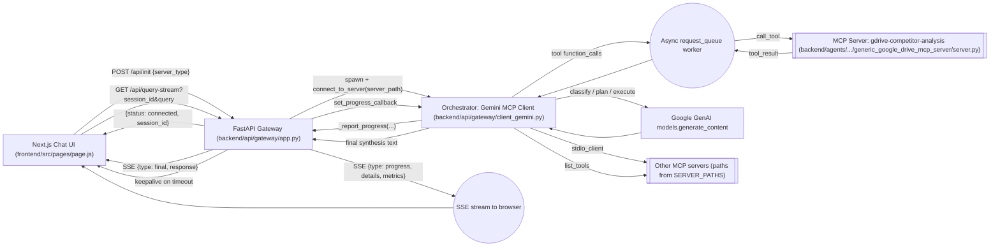
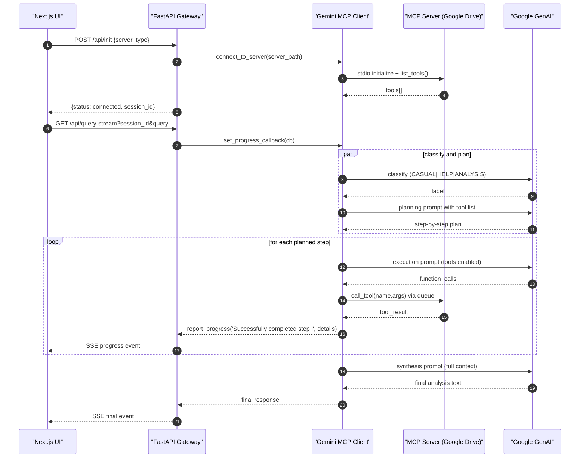
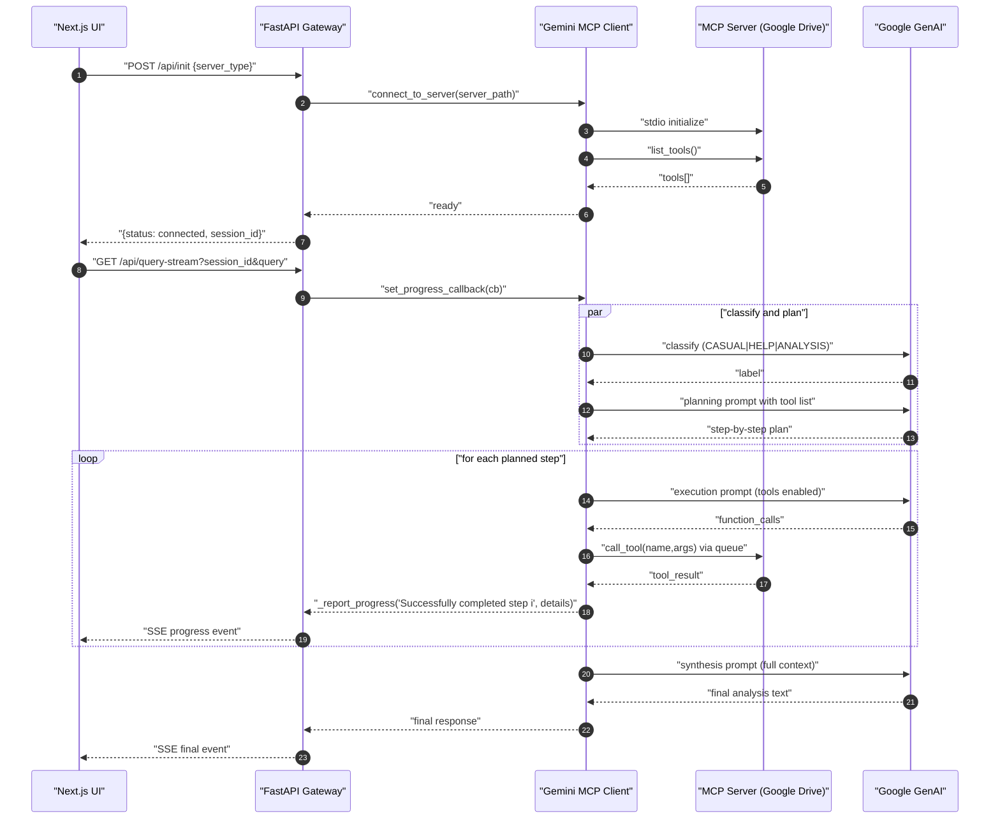

### Agentic AI Knowledge Base Platform

[](https://nextjs.org)
[](https://fastapi.tiangolo.com)
[](https://python.org)
[](https://ai.google.dev)
[](https://modelcontextprotocol.io)
[](LICENSE)

The Agentic AI Knowledge Base Platform provides a modern chat UI that drives an agentic backend orchestrator. It connects to external Model Context Protocol (MCP) servers (e.g., Google Drive analysis) and streams real-time progress and final results to the browser using Server-Sent Events (SSE).

### 🎯 Project Overview

- **Agentic orchestration (MCP)**: The gateway delegates complex tasks to an LLM (Gemini) which plans, calls MCP tools, aggregates results, and synthesizes an answer.
- **Real-time progress**: The UI displays step-by-step progress, metrics, and a final response over SSE.
- **Pluggable servers**: Easily switch among MCP servers (e.g., `rfx`, `samsara`, `raw_rfx`, Google Drive document processing).
- **Production-ready patterns**: CORS, session lifecycle, keepalive, and cleanup logic.

### 🏗️ Architecture





### 🔌 Key Endpoints (FastAPI Gateway)

- `POST /api/init` — Open or replace a session; connects to selected MCP server and returns `{session_id, server_type, available_tools[]}`
- `POST /api/query` — Non-streaming fallback; returns final text only
- `GET /api/query-stream` — Streaming SSE with progress, keepalive, and final events
- `GET /api/server-types` — List of configured server types
- `GET /api/health` — Health and active session count
- `DELETE /api/session/{id}` — Cleanup a session

### 🧠 Involved Components

- **Frontend**: Next.js 15, React 19, Framer Motion, `react-markdown`-based renderer for tables and markdown; SSE consumption and progress UI.
- **Gateway**: FastAPI app (`backend/api/gateway/app.py`) with CORS, session lifecycle, SSE streaming, and graceful shutdown.
- **Orchestrator**: Gemini MCP client (`backend/api/gateway/client_gemini.py`) handling classification, planning, tool execution via MCP, progress reporting, and synthesis.
- **MCP servers**: Example Google Drive analysis server (`backend/agents/document_processor/generic_google_drive_mcp_server/server.py`) exposing tools to list/search and extract content from Drive documents.

## 🚀 Getting Started

### Prerequisites

- Node.js 18+ and npm
- Python 3.11+

### Environment Variables

Create a `.env` file for the backend (recommended at `backend/api/gateway/.env`):

- `GEMINI_API_KEY` — required for Google GenAI
- `ALLOWED_ORIGINS` — optional, CSV of allowed origins for CORS (defaults to localhost)

If you will use the Google Drive MCP server (`generic_google_drive_mcp_server`), also set:

- `GOOGLE_SERVICE_ACCOUNT_FILE` — path to a Service Account JSON with Drive readonly scope
- `BASE_FOLDER_ID` — Google Drive folder id to scope queries

For the frontend (Next.js), set in your shell or a `.env.local` under `frontend/`:

- `NEXT_PUBLIC_API_BASE_URL` — e.g. `http://localhost:8000`

### Backend Setup (FastAPI Gateway)

```bash
# from repo root
python3 -m venv .venv && source .venv/bin/activate
python -m pip install --upgrade pip

# Core runtime deps (minimal set)
pip install fastapi uvicorn[standard] python-dotenv

# LLM + MCP
pip install google-genai mcp

# If using Google Drive MCP server
pip install google-api-python-client google-auth pandas python-docx python-pptx PyPDF2

# Run the API (module path so relative imports work)
uvicorn backend.api.gateway.app:app --reload --host 0.0.0.0 --port 8000
```

### Frontend Setup (Next.js UI)

```bash
cd frontend
npm install

# Ensure NEXT_PUBLIC_API_BASE_URL is set to your API host
export NEXT_PUBLIC_API_BASE_URL=http://localhost:8000

npm run dev
# App will be available on http://localhost:3000
```

## 📡 Using the API

### 1) Initialize a session

```bash
curl -X POST "http://localhost:8000/api/init" \
  -H "Content-Type: application/json" \
  -d '{"server_type":"rfx"}'
```

Response contains `session_id` and `available_tools` for that MCP server.

### 2) Stream a query (SSE)

Open an EventSource to `GET /api/query-stream?session_id=...&query=...` from the browser. The frontend already does this; you can test via the UI.

### 3) Non‑streaming fallback

```bash
curl -X POST "http://localhost:8000/api/query" \
  -H "Content-Type: application/json" \
  -d '{"session_id":"<your_session_id>","query":"Give me an overview"}'
```

## 🔒 Security & Sensitive Information

This repository contains no secrets. Configure credentials at runtime via environment variables.

Omitted for security:

- API keys (e.g., `GEMINI_API_KEY`)
- Google credentials (Service Account JSON)
- Production domains, project IDs, and service configs

Best practices:

- Use environment variables and secret managers; never commit secrets
- Restrict CORS and use HTTPS in production
- Rotate credentials and monitor logs

## 📚 MCP Server: Google Drive (optional)

The server at `backend/agents/document_processor/generic_google_drive_mcp_server/server.py` exposes tools for folder/file listing, full‑text search, and robust content extraction for PDF, Excel, Word, PowerPoint, and TXT.

Required environment:

- `GOOGLE_SERVICE_ACCOUNT_FILE` and `BASE_FOLDER_ID`

Run the server via stdio (the orchestrator spawns it automatically based on `server_type`).

## 🧩 Tech Stack

- **Frontend**: Next.js 15, React 19, Framer Motion, `react-markdown`
- **Backend**: FastAPI, Uvicorn, `python-dotenv`
- **LLM**: Google GenAI (Gemini 2.5 Flash primary; 1.5 fallback)
- **Integration**: MCP (stdio clients/servers)

## 🧪 Development & Testing

- Frontend: `npm run dev`, `npm run test`
- Backend: run the API via `uvicorn ...:app`; tests placeholder exists under `backend/api/gateway/tests/`

## 🐳 Docker (optional)

An example Dockerfile exists at `backend/api/gateway/Dockerfile`. It assumes a `requirements.txt` in the same folder. If you don’t have one, either create it or adjust the Dockerfile to `pip install` the packages shown above.

Example build/run:

```bash
# Build with the gateway folder as context
docker build -f backend/api/gateway/Dockerfile -t agentic-api backend/api/gateway

docker run --rm -p 8000:8000 \
  -e GEMINI_API_KEY=your_key_here \
  agentic-api
```

## 📈 UI/UX Highlights

- Animated, responsive chat UI with suggestion chips
- Markdown and table-aware rendering of model responses
- Real-time progress panel with recent events and phases

## 🗺️ Roadmap (suggested)

- Additional MCP servers for more data sources
- Persistent session store and auth
- Richer progress metrics and telemetry

---

This project demonstrates a pragmatic agentic architecture with MCP, streaming UX, and a clean, composable codebase ready for extension.

## Architecture overview (code-accurate)

- **Backend: FastAPI gateway** (`backend/api/gateway/app.py`)

  - **CORS**: configurable via `ALLOWED_ORIGINS` env (defaults to localhost).
  - **Session lifecycle**:
    - `POST /api/init` creates or replaces a session, instantiates the Gemini MCP client, connects to the selected MCP server via stdio, caches `session_id` → client in memory, and returns available tool names.
    - `DELETE /api/session/{session_id}` cleans up and removes a session.
    - `GET /api/health` returns health and `active_sessions` count.
  - **Query processing**:
    - `POST /api/query` runs a single-turn request via the MCP client and returns the final response JSON.
    - `GET /api/query-stream?session_id=…&query=…` opens an SSE stream:
      - Sets a progress callback into the MCP client.
      - Spawns the analysis task; streams progress events and a final event.
      - Emits keepalive messages on idle timeouts, and a final error message if timeouts accumulate post-completion.

- **Orchestrator: Gemini MCP Client** (`backend/api/gateway/client_gemini.py`)

  - **LLM**: Google GenAI `genai.Client()`; models: `gemini-2.5-flash` primary and final, with `gemini-1.5-flash` fallback.
  - **MCP connection**: `mcp.client.stdio` spawns and connects to an MCP server script path; `ClientSession` handles `initialize`, `list_tools`, and `call_tool`.
  - **Flow per query**:
    - Conversation history management and context compaction.
    - Classification: LLM returns `CASUAL_CONVERSATION | HELP_REQUEST | ANALYSIS_NEEDED`.
    - If casual/help → respond directly; else run strategic analysis:
      - Phase 1–2: Analyze the user query and plan steps using available MCP tools (from `list_tools`).
      - Phase 3: Execute steps:
        - Prompt LLM with tools enabled to produce function calls.
        - Parse `function_calls`; enqueue each into `request_queue`; queue worker calls `session.call_tool`.
        - Collect results; update metrics; stream progress via `_report_progress`.
      - Phase 4: Critical evaluation with LLM over accumulated context.
      - Phase 5: Synthesis with LLM for final answer; return text.
  - **Tool calling**: Cleans schemas for Gemini; extracts function calls; manages async queue; aggregates results; formats results for follow-up prompts.
  - **Progress streaming**: `set_progress_callback` is injected by gateway; client calls it with messages, step markers, and metrics.
  - **Token tracking**: rough usage/cost estimates recorded for each call.

- **Alternative orchestrator (deprecated): Claude MCP Client** (`backend/api/gateway/client_claude.py`)

  - Similar orchestration structure using Anthropic Messages API.
  - Maintained but the gateway defaults to Gemini.

- **Agents (MCP servers)**
  - Google Drive document processing server (`backend/agents/document_processor/generic_google_drive_mcp_server/server.py`):
    - Exposes MCP tools:
      - `list_drive_folders(parent_folder_id?)`
      - `list_drive_files(folder_id?, file_types="all")`
      - `get_file_content(file_id, max_chars=100000)` with content extraction for PDF, Excel, Word, PowerPoint, TXT.
      - `get_file_metadata(file_id)`
      - `search_drive_files(query, folder_id?)`
    - Uses Service Account credentials for Drive API; caches file contents; robust per-type extraction and chunking helpers.
  - Other MCP servers referenced via `SERVER_PATHS` in the gateway:
    - `rfx`: `./backend/agents/rfx_analyzer/mcp-server_rfx/server_test.py`
    - `samsara`: `./backend/agents/samsara_integration/mcp_server_samsara/server.py`
    - `raw_rfx`: `./backend/agents/raw_data_processor/mcp_server_rfx_raw_data/server.py`

## Request flow (expanded, code-accurate)

- **Session**

  - `POST /api/init`:
    - Validates server type against `SERVER_PATHS`.
    - Creates Gemini MCP client → `connect_to_server(server_path)` → `initialize` → `list_tools`.
    - Stores `active_sessions[session_id] = client`, returns `{status: "connected", response: {"session_id", "server_type", "available_tools": [...]}}`.

- **Query (SSE)**

  - `GET /api/query-stream?session_id&query`:
    - Validates session; yields an initial progress event.
    - Injects a `progress_callback` into the MCP client to enqueue progress messages.
    - Runs `client.process_query(query)` in background task.
    - For each queued item: writes an SSE event.
    - On completion: emits a final event with `response` or `error`.
    - Keepalive every ~20s if idle, with cut-off after 3 consecutive timeouts.

- **Query (non-streaming fallback)**

  - `POST /api/query`:
    - Calls `client.process_query(query)` and returns `{status: "success", response}` or `{status: "error", message}`.

- **Frontend consumption**
  - Establishes SSE, updates `progressDetails` and `progressIndicator` with each event, appends final assistant message when `type === 'final'` (`frontend/src/pages/page.js`).

## Notable implementation details

- Gateway initializes the Gemini-based MCP client by default.
- SSE formatting includes step completion detection by parsing messages for “Successfully … step X”.
- MCP client tracks operation metrics (queries executed, documents processed, folders scanned) and includes these in progress details.
- Tool schemas returned by MCP are normalized for Gemini compatibility.
- Google Drive MCP server robustly handles Google MIME exports and per-type parsing.
- Cleanup is implemented on FastAPI lifespan shutdown and explicit `DELETE /api/session/{id}`.

## Diagrams




## Key data contracts

- **Init session**

  - Request: `POST /api/init` with JSON `{ "server_type": "rfx" | "samsara" | "raw_rfx" }`
  - Response (success): `{"status":"connected","response":"{\"session_id\":\"…\",\"server_type\":\"…\",\"available_tools\":[…]}"}`

- **Streaming query**

  - Request: `GET /api/query-stream?session_id=...&query=...` (SSE)
  - Events:
    - Progress: `{ "type":"progress", "message":"…", "details":{...}, "metrics":{...}, "timestamp":... }`
    - Keepalive: `{ "type":"keepalive", "consecutive_timeouts":n, "processing_complete":bool, "queue_empty":bool, "final_sent":bool, "timestamp":... }`
    - Final: `{ "type":"final", "response":"<final_text>", "timestamp":... }`
    - Error: `{ "type":"error", "message":"…", "timestamp":... }`

- **Non-streaming query**
  - Request: `POST /api/query` with `{ "session_id":"…", "query":"…" }`.
  - Response: `{ "status":"success", "response":"<final_text>" }` or `{ "status":"error", "message":"…" }`.

## Endpoints

- `POST /api/init`
- `POST /api/query`
- `GET /api/query-stream`
- `GET /api/server-types`
- `GET /api/health`
- `DELETE /api/session/{id}`
